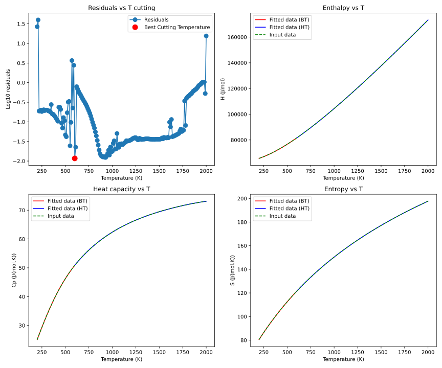

# t2nasa
conversion tool to convert thermodynamic data from JANAF to NASA-7 polynomial format

## Description 
This repository provides a Python script to convert thermodynamic data from JANAF (table) format
into the NASA-7 polynomial format. The NASA-7 format is widely used in computational 
chemistry, combustion modeling, and thermodynamic databases (e.g., for CFD, CHEMKIN, OpenSmoke, ...). 

## How does it work?
**t2nasa** uses a nonlinear least-square fitting procedure (scipy module) and writes an output using `NASA Glenn Coefficients`. 
Detailed information about the `NASA Glenn Coefficients` is supplied 
in [NASA-7](https://ntrs.nasa.gov/api/citations/20020085330/downloads/20020085330.pdf).

## How to use

### Input
The user needs to provide the input in a JANAF table that is then converted by the script into 
a numpy array. Open the main script and adjust the `REQUIRED INPUT INFORMATION` section accordingly. 

### Run **t2nasa**
The script converts the input data in JANAF format into the NASA-7 polynomial format:

* `python3 t2nasa.py`

The user can also generate plots to visualize the fit quality:



**t2nasa** saves the output data in a text file `nasa.dat`:

```text
SPECIES NAME                     SUMFORMULA G    200.00 2000.00 600.00      1
+5.25399813e+00+5.19321661e-02-3.76088928e-05+1.38816568e-08-2.05987837e-12 2
+3.08071045e+04+2.14428089e+00+3.52822356e+00+4.39981302e-02+2.43554990e-05 3
-9.72363985e-08+6.10298172e-11+3.14272779e+04+1.27448190e+01                4
```

## Requirements
**t2nasa** requires the following Python modules/packages:
 * [numpy](https://numpy.org/)
 * [scipy](https://docs.scipy.org/doc/scipy/)
 * [matplotlib](https://matplotlib.org/)
